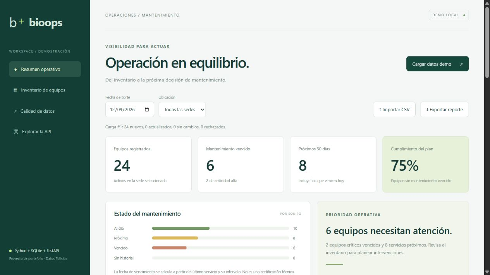
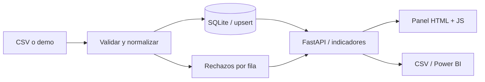

# BioOps Analytics

**De un inventario CSV a un plan de mantenimiento visible, trazable y exportable.**

[](https://github.com/Nicolaspg12/bioops-analytics/actions/workflows/tests.yml)
   



## Problema y solución

Un inventario disperso dificulta identificar equipos con servicio vencido. BioOps valida un CSV, conserva los equipos en SQLite y calcula vencimientos por fecha de corte y sede. Cada carga deja una bitácora con filas insertadas, actualizadas, sin cambios y rechazadas.

Proyecto de portafolio de **Nicolás Santiago Pantoja García**, relacionado con Python, ETL, SQL y gestión de mantenimiento biomédico. Tdos los datos incluidos son ficticios; no está vinculado a un empleador ni se presenta como un sistema clínico certificado.

## Qué puedes demostrar

- **ETL con calidad de datos:** esquema estricto, fechas válidas, identificadores, límites y cuarentena por fila.
- **Persistencia SQL:** clave primaria, restricciones, índice por sede y upsert transaccional.
- **Idempotencia:** importar el mismo archivo no duplica equipos; los valores idénticos se contabilizan como sin cambios.
- **API documentada:** FastAPI con Swagger, filtros y respuestas de error explícitas.
- **Panel operativo:** cumplimiento, equipos vencidos, criticidad, búsqueda, fecha de corte y exportación CSV.
- **Trazabilidad:** las últimas 20 cargas y sus rechazos pueden revisarse desde la interfaz.

## Ejecutar en 3 minutos

Requisito: **Python 3.12**. Desde la carpeta del repositorio:

```powershell
python -m venv .venv
.venv\Scripts\python -m pip install -r requirements-dev.txt
.venv\Scripts\python -m uvicorn app.main:app --host 127.0.0.1 --port 8001
```

En Linux/macOS sustituye `.venv\Scripts\python` por `.venv/bin/python`.

Abre [localhost:8001](http://localhost:8001), pulsa **Cargar datos demo** y explora las sedes. Los 24 equipos demo se generan respecto de la fecha del servidor. Volver a cargarlos otro día actualiza sus fechas. La base local se crea en `data/bioops.db` y no se versiona. `BIOOPS_DB` permite cambiar su ubicación.

También puedes importar `samples/inventory.csv` y seleccionar **2026-09-12** como fecha de corte para reproducir ese ejemplo fijo. `samples/invalid_rows.csv` demuestra el rechazo de registros.

### Docker

```sh
docker compose up --build
```

Mismo puerto 8001; el volumen `bioops-data` conserva la base. El contenedor ejecuta como usuario sin privilegios. Docker se entrega como alternativa; consulta el alcance real de validación en [VALIDATION.md](docs/VALIDATION.md).

## Contrato del CSV

UTF-8, máximo 2 MB y 10.000 filas. Columnas en este orden:

```csv
asset_id,name,category,location,last_service,interval_days,criticality
BIO-001,Monitor de ejemplo,Monitoreo,Sede Norte,2026-03-01,180,alta
```

| Campo | Regla |
|---|---|
| `asset_id` | 1–40 letras, números, `_` o `-`; único |
| `name`, `category`, `location` | Texto no vacío, máximo 100 caracteres |
| `last_service` | Fecha real `YYYY-MM-DD` |
| `interval_days` | Entero entre 1 y 3650 |
| `criticality` | `alta`, `media` o `baja` |

El primer registro válido de un ID en un archivo prevalece; los duplicados posteriores se rechazan. Una cabecera inválida rechaza la carga completa. Las filas inválidas se omiten y se registra su motivo; las válidas se guardan en una transacción junto con la bitácora. Cambiar el ID crea un equipo nuevo: no renombra el anterior.

## Reglas de los indicadores

`próximo servicio = último servicio + intervalo`. Vencido: fecha anterior al corte. Próximo: vence entre hoy y los siguientes 30 días, inclusive. Al día: vence después de 30 días. Cumplimiento: porcentaje de equipos conocidos que no están vencidos, incluidos los próximos. Si el último servicio es posterior al corte, el equipo se marca **sin historial** y se excluye del denominador. No se conserva un historial completo de mantenimientos y no debe interpretarse como una reconstrucción histórica.

## API

Swagger: [localhost:8001/docs](http://localhost:8001/docs).

| Método | Ruta | Uso |
|---|---|---|
| GET | `/api/health` | Estado del proceso |
| POST | `/api/demo` | Cargar 24 equipos sintéticos |
| POST | `/api/import` | Cuerpo CSV UTF-8 |
| GET | `/api/dashboard?as_of=2026-09-12&location=Sede%20Norte` | Equipos e indicadores |
| GET | `/api/runs` | Últimas cargas y errores |
| GET | `/api/export` | CSV de los equipos filtrados; mismos filtros que dashboard |

El CSV exportado usa UTF-8 con BOM y neutraliza prefijos de fórmulas en etiquetas importadas. Puede cargarse en Power BI usando **Obtener datos → Texto/CSV**. No incluye un archivo `.pbix`.

## Arquitectura



```text
app/etl.py           Validación, carga y cálculo de vencimientos
app/main.py          API y exportación
app/static/          Interfaz sin build ni CDN
tests/               Pruebas de negocio y API
samples/             CSV de ejemplo
docs/                Decisiones, validación y guía de presentación
```

## Pruebas y próximos pasos

```sh
python -m pytest -q
```

CI en GitHub Actions ejecuta la misma suite en Python 3.12. Consulta [validación](docs/VALIDATION.md), [decisiones técnicas](docs/ARCHITECTURE.md) y [guía para explicar el proyecto](docs/PORTFOLIO.md).

Posibles extensiones: historial de órdenes de trabajo, PostgreSQL, autenticación, migraciones y un modelo dimensional para Power BI. La versión actual es una demo local de un usuario, sin autenticación; no debe exponerse directamente a Internet.

## Licencia

Protecciones, revisión y límites de uso: [SECURITY.md](SECURITY.md).

[MIT](LICENSE).
